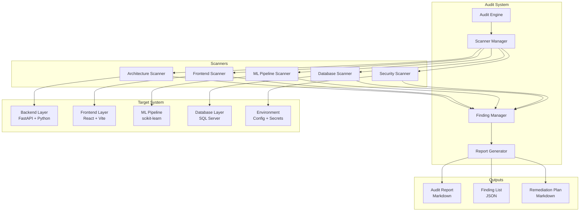
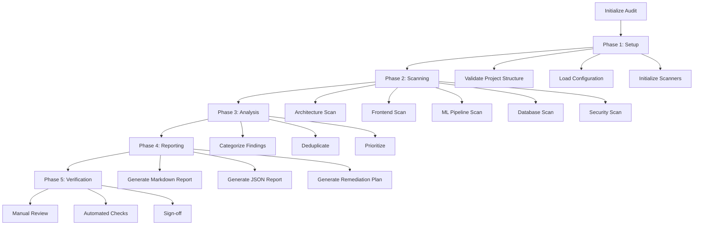
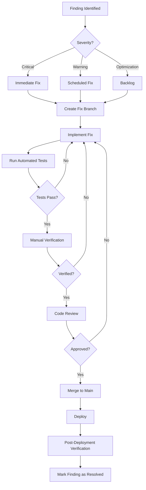

# Design Document: 360° Code Audit for DefectAI P7

## Overview

The 360° Code Audit System is a comprehensive static analysis and verification tool designed to systematically evaluate the DefectAI P7 application across five critical pillars: Architecture & Backend, Frontend, AI/ML Pipeline, Database, and Security & Environment. The system performs automated code scanning, pattern matching, and manual verification to identify critical bugs, warnings, and optimization opportunities, then generates actionable audit reports with exact file paths, line numbers, and remediation plans.

### Design Goals

1. **Comprehensive Coverage**: Examine all layers of the application stack (backend, frontend, ML, database, security)
2. **Actionable Findings**: Provide exact file paths, line numbers, and specific code changes for each issue
3. **Severity Classification**: Categorize findings as Critical (🔴), Warning (🟠), or Optimization (🟢)
4. **Automated + Manual**: Combine automated pattern matching with manual verification for accuracy
5. **Remediation-Focused**: Include verification steps and rollback procedures for each fix

### Key Principles

- **Static Analysis First**: Prioritize file scanning and pattern matching over runtime analysis
- **Context-Aware**: Understand the DefectAI P7 architecture (FastAPI backend, React frontend, SQL Server, scikit-learn ML)
- **Non-Invasive**: Read-only operations during audit; no code modifications
- **Incremental**: Support pillar-by-pillar execution for manageable audit scope
- **Traceable**: Link every finding back to specific requirements and acceptance criteria

## Architecture

### High-Level Architecture



### Component Responsibilities

#### Audit Engine
- Orchestrates the entire audit workflow
- Manages pillar execution order and dependencies
- Coordinates scanner lifecycle (initialize, execute, cleanup)
- Aggregates findings from all scanners
- Handles error recovery and partial audit completion

#### Scanner Manager
- Instantiates and configures individual scanners
- Provides file system access utilities
- Manages scanner state and progress tracking
- Implements scanner interface contract

#### Finding Manager
- Collects findings from all scanners
- Deduplicates similar findings
- Categorizes findings by severity (Critical/Warning/Optimization)
- Links findings to requirements and acceptance criteria
- Calculates finding statistics and summaries

#### Report Generator
- Formats findings into Markdown audit report
- Generates JSON finding list for programmatic access
- Creates remediation plans with verification steps
- Produces summary dashboards and metrics

#### Individual Scanners
Each scanner implements a common interface:
```python
class Scanner(ABC):
    @abstractmethod
    def scan(self) -> List[Finding]:
        """Execute scanner logic and return findings"""
        pass
    
    @abstractmethod
    def get_pillar_name(self) -> str:
        """Return pillar name for reporting"""
        pass
```

## Components and Interfaces

### Core Data Models

#### Finding Model
```python
@dataclass
class Finding:
    id: str  # Unique identifier (UUID)
    pillar: str  # Architecture, Frontend, ML, Database, Security
    severity: str  # CRITICAL, WARNING, OPTIMIZATION
    title: str  # Short description
    description: str  # Detailed explanation
    file_path: str  # Relative path from project root
    line_number: Optional[int]  # Specific line (if applicable)
    code_snippet: Optional[str]  # Relevant code excerpt
    impact: str  # Impact assessment
    requirement_id: str  # Links to requirements.md (e.g., "1.3")
    remediation: Remediation  # Fix instructions
    verification: Verification  # How to verify the fix
```

#### Remediation Model
```python
@dataclass
class Remediation:
    steps: List[str]  # Ordered fix steps
    code_before: Optional[str]  # Current code
    code_after: Optional[str]  # Proposed fix
    files_to_modify: List[str]  # All affected files
    estimated_effort: str  # LOW, MEDIUM, HIGH
    risk_level: str  # LOW, MEDIUM, HIGH
    rollback_procedure: Optional[str]  # How to undo changes
```

#### Verification Model
```python
@dataclass
class Verification:
    manual_steps: List[str]  # Human verification steps
    automated_checks: List[str]  # Commands to run
    expected_outcome: str  # What success looks like
    test_commands: List[str]  # Test commands to execute
```

### Scanner Interfaces

#### Architecture Scanner Interface
```python
class ArchitectureScanner(Scanner):
    def scan_layer_separation(self) -> List[Finding]:
        """Check routes → controllers → services → repositories"""
        pass
    
    def scan_input_validation(self) -> List[Finding]:
        """Verify Pydantic schema usage"""
        pass
    
    def scan_exception_handling(self) -> List[Finding]:
        """Check error handling patterns"""
        pass
    
    def scan_rbac_enforcement(self) -> List[Finding]:
        """Verify RoleChecker usage"""
        pass
```

#### Frontend Scanner Interface
```python
class FrontendScanner(Scanner):
    def scan_api_integration(self) -> List[Finding]:
        """Check API response parsing consistency"""
        pass
    
    def scan_error_handling(self) -> List[Finding]:
        """Verify error handling in API calls"""
        pass
    
    def scan_memory_leaks(self) -> List[Finding]:
        """Check useEffect cleanup functions"""
        pass
    
    def scan_rerender_optimization(self) -> List[Finding]:
        """Analyze dependency arrays"""
        pass
```

#### ML Pipeline Scanner Interface
```python
class MLPipelineScanner(Scanner):
    def scan_data_leakage(self) -> List[Finding]:
        """Check train/test split order"""
        pass
    
    def scan_model_sync(self) -> List[Finding]:
        """Verify artifact-database synchronization"""
        pass
    
    def scan_model_versioning(self) -> List[Finding]:
        """Check version naming conventions"""
        pass
    
    def scan_evaluation_metrics(self) -> List[Finding]:
        """Verify metric completeness"""
        pass
```

#### Database Scanner Interface
```python
class DatabaseScanner(Scanner):
    def scan_n_plus_one(self) -> List[Finding]:
        """Detect queries in loops"""
        pass
    
    def scan_foreign_keys(self) -> List[Finding]:
        """Check referential integrity"""
        pass
    
    def scan_sql_injection(self) -> List[Finding]:
        """Verify parameterized queries"""
        pass
    
    def scan_connection_management(self) -> List[Finding]:
        """Check connection cleanup"""
        pass
```

#### Security Scanner Interface
```python
class SecurityScanner(Scanner):
    def scan_hardcoded_secrets(self) -> List[Finding]:
        """Find hardcoded credentials"""
        pass
    
    def scan_cors_config(self) -> List[Finding]:
        """Check CORS settings"""
        pass
    
    def scan_password_hashing(self) -> List[Finding]:
        """Verify hashing algorithms"""
        pass
    
    def scan_xss_vulnerabilities(self) -> List[Finding]:
        """Check input sanitization"""
        pass
```

## Data Models

### File Scanning Patterns

#### Pattern Matching Rules
```python
PATTERNS = {
    "hardcoded_password": r'(password|pwd|passwd)\s*=\s*["\'](?!.*\{.*\})[^"\']+["\']',
    "hardcoded_api_key": r'(api_key|apikey|secret_key)\s*=\s*["\'][^"\']+["\']',
    "sql_injection": r'(execute|cursor\.execute)\s*\(\s*f["\']|\.format\(',
    "missing_validation": r'@router\.(post|put|patch).*\n(?!.*:\s*\w+Schema)',
    "missing_cleanup": r'useEffect\s*\([^)]*\)\s*,\s*\[[^\]]*\]\s*\)(?!.*return)',
    "n_plus_one": r'for\s+\w+\s+in.*:\s*\n\s*(fetch_one|fetch_all|execute_query)',
}
```

#### File Path Patterns
```python
SCAN_PATHS = {
    "architecture": [
        "backend/app/routes/**/*.py",
        "backend/app/controllers/**/*.py",
        "backend/app/services/**/*.py",
        "backend/app/repositories/**/*.py",
    ],
    "frontend": [
        "frontend/src/services/**/*.js",
        "frontend/src/api/**/*.js",
        "frontend/src/hooks/**/*.js",
        "frontend/src/auth/**/*.js",
        "frontend/src/components/**/*.jsx",
        "frontend/src/pages/**/*.jsx",
    ],
    "ml_pipeline": [
        "backend/app/ml/**/*.py",
    ],
    "database": [
        "backend/app/repositories/**/*.py",
        "backend/app/database.py",
        "backend/app/permission_database.py",
        "backend/sql/**/*.sql",
    ],
    "security": [
        "backend/app/**/*.py",
        "frontend/src/**/*.{js,jsx}",
        "backend/.env",
        "frontend/.env",
        ".gitignore",
    ],
}
```

### Finding Categorization Logic

#### Severity Classification Rules
```python
def classify_severity(finding_type: str, context: dict) -> str:
    """
    CRITICAL: Security vulnerabilities, data loss risks, system failures
    WARNING: Performance issues, maintainability problems, future risks
    OPTIMIZATION: Best practices, code quality improvements
    """
    CRITICAL_PATTERNS = [
        "sql_injection",
        "hardcoded_password",
        "missing_foreign_key",
        "data_leakage",
        "xss_vulnerability",
        "missing_rbac",
        "connection_leak",
        "cors_wildcard_production",
    ]
    
    WARNING_PATTERNS = [
        "missing_error_handling",
        "inconsistent_api_response",
        "missing_index",
        "n_plus_one_query",
        "missing_transaction",
        "weak_jwt_config",
    ]
    
    if finding_type in CRITICAL_PATTERNS:
        return "CRITICAL"
    elif finding_type in WARNING_PATTERNS:
        return "WARNING"
    else:
        return "OPTIMIZATION"
```

### Audit Report Structure

#### Markdown Report Format
```markdown
# 360° Code Audit Report: DefectAI P7

**Generated**: {timestamp}
**Project**: DefectAI P7
**Audit Scope**: All 5 Pillars

## Executive Summary

- **Total Findings**: {total_count}
- **Critical Issues** 🔴: {critical_count}
- **Warnings** 🟠: {warning_count}
- **Optimizations** 🟢: {optimization_count}

### Findings by Pillar

| Pillar | Critical | Warning | Optimization | Total |
|--------|----------|---------|--------------|-------|
| Architecture & Backend | {count} | {count} | {count} | {count} |
| Frontend | {count} | {count} | {count} | {count} |
| ML Pipeline | {count} | {count} | {count} | {count} |
| Database | {count} | {count} | {count} | {count} |
| Security & Environment | {count} | {count} | {count} | {count} |

---

## Pillar 1: Architecture & Backend

### 🔴 Critical Issues

#### Finding 1.1: {Title}

**File**: `{file_path}:{line_number}`
**Severity**: CRITICAL
**Requirement**: {requirement_id}

**Description**:
{detailed_description}

**Impact**:
{impact_assessment}

**Current Code**:
```python
{code_snippet}
```

**Remediation**:
1. {step_1}
2. {step_2}

**Proposed Fix**:
```python
{fixed_code}
```

**Verification**:
- [ ] {verification_step_1}
- [ ] {verification_step_2}

**Commands**:
```bash
{test_command}
```

---

[Repeat for all findings in all pillars]

## Appendix A: Verification Checklist

- [ ] All Critical Issues Resolved
- [ ] All Warning Issues Reviewed
- [ ] Optimization Issues Prioritized
- [ ] Tests Pass After Fixes
- [ ] Manual Verification Complete

## Appendix B: Remediation Priority Matrix

| Priority | Severity | Count | Estimated Effort |
|----------|----------|-------|------------------|
| P0 | Critical + High Risk | {count} | {effort} |
| P1 | Critical + Medium Risk | {count} | {effort} |
| P2 | Warning + High Impact | {count} | {effort} |
| P3 | Warning + Medium Impact | {count} | {effort} |
| P4 | Optimization | {count} | {effort} |
```

## Error Handling

### Error Categories

#### Scanner Errors
- **File Not Found**: Skip file and log warning
- **Parse Error**: Mark file as unparseable, continue with other files
- **Permission Denied**: Log error, skip file
- **Timeout**: Set per-file timeout (30s), skip on timeout

#### Analysis Errors
- **Pattern Match Failure**: Log pattern, continue with other patterns
- **False Positive**: Implement confidence scoring, flag low-confidence findings
- **Context Missing**: Mark finding as "needs manual review"

### Error Recovery Strategy

```python
class AuditEngine:
    def execute_audit(self, pillars: List[str]) -> AuditReport:
        findings = []
        errors = []
        
        for pillar in pillars:
            try:
                scanner = self.scanner_manager.get_scanner(pillar)
                pillar_findings = scanner.scan()
                findings.extend(pillar_findings)
            except ScannerError as e:
                errors.append({
                    "pillar": pillar,
                    "error": str(e),
                    "timestamp": datetime.now(),
                })
                # Continue with next pillar
                continue
            except Exception as e:
                # Log unexpected error but continue
                self.logger.error(f"Unexpected error in {pillar}: {e}")
                errors.append({
                    "pillar": pillar,
                    "error": f"Unexpected: {str(e)}",
                    "timestamp": datetime.now(),
                })
                continue
        
        return AuditReport(
            findings=findings,
            errors=errors,
            completed_pillars=[p for p in pillars if p not in [e["pillar"] for e in errors]],
            partial_completion=len(errors) > 0,
        )
```

### Graceful Degradation

1. **Pillar-Level Isolation**: Failure in one pillar doesn't stop other pillars
2. **File-Level Isolation**: Failure in one file doesn't stop scanning other files
3. **Pattern-Level Isolation**: Failure in one pattern doesn't stop other patterns
4. **Partial Reports**: Generate report even if some pillars fail
5. **Error Summary**: Include error section in report for transparency

## Testing Strategy

### Testing Approach

This audit system is primarily a **static analysis and reporting tool** that performs file scanning, pattern matching, and report generation. The system does not have runtime behavior that varies meaningfully with different inputs in a way that would benefit from property-based testing. Instead, the testing strategy focuses on:

1. **Example-Based Unit Tests**: Verify specific scanning patterns, finding categorization, and report generation with concrete examples
2. **Integration Tests**: Test end-to-end audit execution on sample codebases
3. **Snapshot Tests**: Verify report format consistency
4. **Manual Verification**: Human review of audit findings for accuracy

### Why Property-Based Testing Is Not Applicable

Property-based testing (PBT) is designed for testing universal properties across a wide range of inputs, typically for pure functions with clear input/output behavior. The audit system does not fit this model because:

1. **Configuration Validation, Not Transformation**: The audit system validates code patterns and configurations rather than transforming data
2. **Static Analysis**: The system performs one-time file scanning, not repeated operations with varying inputs
3. **Deterministic Output**: Given the same codebase, the audit always produces the same findings
4. **External Dependencies**: The system depends on file system access and code parsing, which are infrastructure concerns
5. **Subjective Findings**: Many findings require human judgment (e.g., "is this error message user-friendly?")

### Unit Testing Strategy

#### Scanner Unit Tests
Test each scanner with concrete code examples:

```python
def test_architecture_scanner_detects_layer_violation():
    """Test that controller directly accessing database is flagged"""
    code = '''
    def create_project(payload: ProjectCreate):
        # VIOLATION: Controller directly accessing database
        conn = get_connection()
        cursor = conn.cursor()
        cursor.execute("INSERT INTO Projects ...")
    '''
    scanner = ArchitectureScanner()
    findings = scanner.scan_layer_separation()
    assert any(f.title == "Layer Violation: Controller Accessing Database" for f in findings)

def test_security_scanner_detects_hardcoded_password():
    """Test that hardcoded passwords are detected"""
    code = '''
    DATABASE_PASSWORD = "123456"  # VIOLATION
    '''
    scanner = SecurityScanner()
    findings = scanner.scan_hardcoded_secrets()
    assert len(findings) > 0
    assert findings[0].severity == "CRITICAL"
```

#### Finding Manager Unit Tests
Test finding categorization and deduplication:

```python
def test_finding_manager_categorizes_by_severity():
    """Test that findings are correctly categorized"""
    findings = [
        Finding(severity="CRITICAL", ...),
        Finding(severity="WARNING", ...),
        Finding(severity="OPTIMIZATION", ...),
    ]
    manager = FindingManager()
    categorized = manager.categorize(findings)
    assert len(categorized["CRITICAL"]) == 1
    assert len(categorized["WARNING"]) == 1
    assert len(categorized["OPTIMIZATION"]) == 1

def test_finding_manager_deduplicates_similar_findings():
    """Test that duplicate findings are merged"""
    findings = [
        Finding(file_path="app/main.py", line_number=10, title="SQL Injection"),
        Finding(file_path="app/main.py", line_number=10, title="SQL Injection"),
    ]
    manager = FindingManager()
    deduplicated = manager.deduplicate(findings)
    assert len(deduplicated) == 1
```

#### Report Generator Unit Tests
Test report formatting and structure:

```python
def test_report_generator_creates_markdown():
    """Test that report is valid Markdown"""
    findings = [Finding(severity="CRITICAL", title="Test Finding", ...)]
    generator = ReportGenerator()
    report = generator.generate_markdown(findings)
    assert "# 360° Code Audit Report" in report
    assert "## Executive Summary" in report
    assert "🔴" in report  # Critical emoji

def test_report_generator_creates_json():
    """Test that JSON report is valid"""
    findings = [Finding(severity="CRITICAL", title="Test Finding", ...)]
    generator = ReportGenerator()
    json_report = generator.generate_json(findings)
    data = json.loads(json_report)
    assert "findings" in data
    assert len(data["findings"]) == 1
```

### Integration Testing Strategy

#### End-to-End Audit Tests
Test complete audit workflow on sample projects:

```python
def test_full_audit_on_sample_project():
    """Test complete audit execution"""
    engine = AuditEngine()
    report = engine.execute_audit(pillars=["architecture", "frontend", "ml", "database", "security"])
    
    assert report.completed_pillars == ["architecture", "frontend", "ml", "database", "security"]
    assert len(report.findings) > 0
    assert report.partial_completion == False

def test_audit_handles_missing_files_gracefully():
    """Test that audit continues when files are missing"""
    engine = AuditEngine()
    # Point to non-existent directory
    engine.config.project_root = "/nonexistent/path"
    report = engine.execute_audit(pillars=["architecture"])
    
    # Should complete but with errors
    assert len(report.errors) > 0
    assert report.partial_completion == True
```

### Manual Verification Strategy

#### Audit Accuracy Verification
1. **Sample Codebase Testing**: Run audit on known codebases with documented issues
2. **False Positive Review**: Manually review 10% of findings to check accuracy
3. **False Negative Testing**: Intentionally introduce known issues and verify detection
4. **Expert Review**: Have domain experts review findings for relevance

#### Report Quality Verification
1. **Readability**: Human review of generated reports
2. **Actionability**: Verify that remediation steps are clear and complete
3. **Completeness**: Check that all requirements are covered
4. **Consistency**: Verify consistent formatting and terminology

### Test Coverage Goals

- **Scanner Logic**: 80% code coverage for pattern matching and detection logic
- **Finding Management**: 90% code coverage for categorization and deduplication
- **Report Generation**: 85% code coverage for formatting and output
- **Integration**: 100% coverage of pillar execution paths
- **Error Handling**: 100% coverage of error recovery paths

### Testing Tools and Frameworks

- **Unit Testing**: pytest (Python), Jest (JavaScript)
- **Code Coverage**: pytest-cov, coverage.py
- **Static Analysis**: pylint, flake8, ESLint (for testing the audit tool itself)
- **Integration Testing**: pytest with fixtures for sample codebases
- **Snapshot Testing**: pytest-snapshot for report format verification

### Continuous Testing

- **Pre-commit Hooks**: Run unit tests before commits
- **CI/CD Pipeline**: Run full test suite on every pull request
- **Regression Testing**: Maintain test suite of known issues and verify detection
- **Performance Testing**: Monitor audit execution time on large codebases

---

**Note**: This testing strategy prioritizes practical verification of the audit system's accuracy and reliability over theoretical property-based testing, which is not applicable to this type of static analysis tool.


## Detailed Scanner Methodologies

### Pillar 1: Architecture & Backend Scanner

#### Methodology

The Architecture Scanner examines the FastAPI backend to ensure proper layer separation, input validation, error handling, and RBAC enforcement.

#### Layer Separation Detection

**Algorithm**:
1. Parse all Python files in routes, controllers, services, repositories
2. Build call graph using AST analysis
3. Detect violations:
   - Routes calling repositories directly (skip controllers/services)
   - Controllers calling database functions directly (skip services)
   - Services containing SQL queries (should delegate to repositories)

**Implementation**:
```python
def scan_layer_separation(self) -> List[Finding]:
    findings = []
    
    # Check routes
    for route_file in glob("backend/app/routes/**/*.py"):
        tree = ast.parse(read_file(route_file))
        for node in ast.walk(tree):
            if isinstance(node, ast.Call):
                # Check if route calls repository directly
                if self._is_repository_call(node):
                    findings.append(Finding(
                        severity="WARNING",
                        title="Layer Violation: Route Bypassing Controller",
                        file_path=route_file,
                        line_number=node.lineno,
                        requirement_id="1.2",
                    ))
    
    # Check controllers
    for controller_file in glob("backend/app/controllers/**/*.py"):
        tree = ast.parse(read_file(controller_file))
        for node in ast.walk(tree):
            if isinstance(node, ast.Call):
                # Check if controller calls database directly
                if self._is_database_call(node):
                    findings.append(Finding(
                        severity="CRITICAL",
                        title="Layer Violation: Controller Accessing Database",
                        file_path=controller_file,
                        line_number=node.lineno,
                        requirement_id="1.3",
                    ))
    
    return findings
```

#### Input Validation Detection

**Algorithm**:
1. Parse all route files
2. Extract endpoint decorators (@router.post, @router.put, @router.patch)
3. Check function signature for Pydantic schema parameters
4. Flag endpoints without schema validation

**Pattern**:
```python
# GOOD: Has Pydantic validation
@router.post("/projects")
def create_project(payload: ProjectCreate):
    ...

# BAD: Missing validation
@router.post("/projects")
def create_project(payload: dict):  # Should use ProjectCreate schema
    ...
```

#### Exception Handling Detection

**Algorithm**:
1. Parse service and controller files
2. Identify try-except blocks
3. Check for:
   - Generic `except Exception` without logging
   - Empty except blocks
   - Catching exceptions without re-raising or handling

**Pattern**:
```python
# BAD: Generic exception without logging
try:
    result = some_operation()
except Exception:
    pass  # Silent failure

# GOOD: Specific exception with logging
try:
    result = some_operation()
except ValueError as e:
    logger.error(f"Operation failed: {e}")
    raise HTTPException(status_code=400, detail=str(e))
```

#### RBAC Enforcement Detection

**Algorithm**:
1. Parse all route files
2. Identify protected endpoints (those requiring authentication)
3. Check for `Depends(RoleChecker(...))` in function signature
4. Flag protected endpoints without role checking

**Pattern**:
```python
# GOOD: Has RBAC
@router.delete("/projects/{project_id}")
def delete_project(
    project_id: int,
    current_user: dict = Depends(RoleChecker(["Admin"]))
):
    ...

# BAD: Missing RBAC
@router.delete("/projects/{project_id}")
def delete_project(project_id: int):  # Should have RoleChecker
    ...
```

### Pillar 2: Frontend Scanner

#### Methodology

The Frontend Scanner examines the React application to identify API integration issues, state management problems, error handling gaps, and memory leaks.

#### API Response Parsing Detection

**Algorithm**:
1. Parse all service files in `frontend/src/services`
2. Extract axios/fetch calls
3. Check response handling patterns
4. Flag inconsistent patterns (res.data vs res.data.data)

**Pattern**:
```javascript
// INCONSISTENT: Mixed patterns
export const getProjects = async () => {
  const res = await axiosClient.get("/projects");
  return res.data;  // Pattern 1
};

export const getDatasets = async () => {
  const res = await axiosClient.get("/datasets");
  return res.data.data;  // Pattern 2 - INCONSISTENT
};

// CONSISTENT: Uniform pattern
export const getProjects = async () => {
  const res = await axiosClient.get("/projects");
  return res.data;  // axiosClient interceptor already unwraps
};
```

#### Error Handling Detection

**Algorithm**:
1. Parse all service and API files
2. Identify async functions making API calls
3. Check for try-catch blocks
4. Verify error messages are user-friendly (not technical)

**Pattern**:
```javascript
// BAD: No error handling
export const createProject = async (data) => {
  const res = await axiosClient.post("/projects", data);
  return res.data;
};

// GOOD: Proper error handling
export const createProject = async (data) => {
  try {
    const res = await axiosClient.post("/projects", data);
    return res.data;
  } catch (error) {
    throw new Error(error.message || "Failed to create project");
  }
};
```

#### Memory Leak Detection

**Algorithm**:
1. Parse all custom hooks and components
2. Identify useEffect hooks
3. Check for subscriptions, timers, event listeners
4. Verify cleanup function (return statement) exists

**Pattern**:
```javascript
// BAD: Missing cleanup
useEffect(() => {
  const interval = setInterval(() => {
    fetchData();
  }, 5000);
  // Missing cleanup - MEMORY LEAK
}, []);

// GOOD: Has cleanup
useEffect(() => {
  const interval = setInterval(() => {
    fetchData();
  }, 5000);
  return () => clearInterval(interval);  // Cleanup
}, []);
```

#### Re-render Optimization Detection

**Algorithm**:
1. Parse all components
2. Identify useEffect, useMemo, useCallback hooks
3. Check dependency arrays
4. Flag missing or overly broad dependencies

**Pattern**:
```javascript
// BAD: Missing dependency array
useEffect(() => {
  fetchData(projectId);
});  // Runs on every render

// BAD: Unnecessary dependencies
useEffect(() => {
  fetchData(projectId);
}, [projectId, someUnrelatedState]);  // someUnrelatedState causes unnecessary re-runs

// GOOD: Correct dependencies
useEffect(() => {
  fetchData(projectId);
}, [projectId]);  // Only re-runs when projectId changes
```

### Pillar 3: ML Pipeline Scanner

#### Methodology

The ML Pipeline Scanner examines the machine learning workflow to prevent data leakage, ensure database synchronization, verify prediction consistency, and validate model versioning.

#### Data Leakage Detection

**Algorithm**:
1. Parse ML training files (`backend/app/ml/train_models.py`, `feature_engineering.py`, `preprocessing.py`)
2. Build execution flow graph
3. Identify train_test_split call
4. Check if any feature engineering or preprocessing happens before split
5. Flag operations that use test data before split

**Pattern**:
```python
# BAD: Data leakage - scaling before split
df = pd.read_csv("data.csv")
scaler = StandardScaler()
df_scaled = scaler.fit_transform(df)  # Uses ALL data including test
X_train, X_test, y_train, y_test = train_test_split(df_scaled, y)

# GOOD: Scaling after split
df = pd.read_csv("data.csv")
X_train, X_test, y_train, y_test = train_test_split(df, y)
scaler = StandardScaler()
X_train_scaled = scaler.fit_transform(X_train)  # Only fits on train
X_test_scaled = scaler.transform(X_test)  # Only transforms test
```

#### Model-Database Synchronization Detection

**Algorithm**:
1. Parse training service (`ml_training_service.py`)
2. Identify model artifact save operations (joblib.dump)
3. Check for corresponding database insert/update
4. Verify both operations are in same transaction or error handling block

**Pattern**:
```python
# BAD: Artifact saved but database not updated
joblib.dump(model, "model.joblib")
# Missing database update - SYNC FAILURE

# GOOD: Both artifact and database updated
joblib.dump(model, "model.joblib")
model_id = model_repository.upsert_production_model({
    "artifact_path": "model.joblib",
    "version": version,
    ...
})
```

#### Model Versioning Detection

**Algorithm**:
1. Parse training service
2. Extract model artifact naming logic
3. Verify version format follows convention (v{timestamp})
4. Check that version is stored in both artifact metadata and database

**Pattern**:
```python
# BAD: No version identifier
joblib.dump(model, "model.joblib")  # No version

# GOOD: Versioned artifact
version = datetime.now().strftime("v%Y%m%d%H%M%S")
joblib.dump(model, f"model_{version}.joblib")
```

#### Evaluation Metrics Completeness Detection

**Algorithm**:
1. Parse evaluation module (`evaluation.py`) and training service
2. Extract metrics calculation code
3. Verify all standard metrics are computed:
   - accuracy_score
   - precision_score
   - recall_score
   - f1_score
   - roc_auc_score
4. Check confusion_matrix is generated and stored

**Pattern**:
```python
# INCOMPLETE: Missing metrics
metrics = {
    "accuracy": accuracy_score(y_test, y_pred),
    # Missing precision, recall, f1, roc_auc
}

# COMPLETE: All metrics
metrics = {
    "accuracy": accuracy_score(y_test, y_pred),
    "precision": precision_score(y_test, y_pred),
    "recall": recall_score(y_test, y_pred),
    "f1_score": f1_score(y_test, y_pred),
    "roc_auc": roc_auc_score(y_test, probabilities),
}
cm = confusion_matrix(y_test, y_pred)
```

### Pillar 4: Database Scanner

#### Methodology

The Database Scanner examines SQL queries and database access patterns to identify N+1 queries, missing foreign keys, SQL injection vulnerabilities, and connection management issues.

#### N+1 Query Detection

**Algorithm**:
1. Parse all repository files
2. Build control flow graph
3. Identify loops (for, while)
4. Check if database queries (fetch_one, fetch_all, execute_query) are inside loops
5. Flag as N+1 query pattern

**Pattern**:
```python
# BAD: N+1 query
projects = fetch_all("SELECT * FROM Projects")
for project in projects:
    datasets = fetch_all(
        "SELECT * FROM MetricsDatasets WHERE project_id = ?",
        [project["id"]]
    )  # N+1: One query per project

# GOOD: Single query with JOIN
results = fetch_all("""
    SELECT p.*, d.*
    FROM Projects p
    LEFT JOIN MetricsDatasets d ON p.id = d.project_id
""")
```

#### Foreign Key Detection

**Algorithm**:
1. Parse SQL schema files (`backend/sql/*.sql`)
2. Extract table definitions
3. Identify columns ending in `_id` (foreign key convention)
4. Check if FOREIGN KEY constraint is defined
5. Flag missing constraints

**Pattern**:
```sql
-- BAD: Missing foreign key
CREATE TABLE MetricsDatasets (
    id INT PRIMARY KEY,
    project_id INT,  -- References Projects but no FK constraint
    ...
);

-- GOOD: Has foreign key
CREATE TABLE MetricsDatasets (
    id INT PRIMARY KEY,
    project_id INT,
    FOREIGN KEY (project_id) REFERENCES Projects(id),
    ...
);
```

#### SQL Injection Detection

**Algorithm**:
1. Parse all repository files
2. Identify database query calls (execute_query, fetch_all, fetch_one)
3. Check query construction method:
   - String concatenation: VULNERABLE
   - f-strings: VULNERABLE
   - .format(): VULNERABLE
   - Parameterized (?, params): SAFE
4. Flag vulnerable patterns

**Pattern**:
```python
# VULNERABLE: String concatenation
query = f"SELECT * FROM Projects WHERE id = {project_id}"
fetch_one(query)

# VULNERABLE: .format()
query = "SELECT * FROM Projects WHERE id = {}".format(project_id)
fetch_one(query)

# SAFE: Parameterized query
query = "SELECT * FROM Projects WHERE id = ?"
fetch_one(query, [project_id])
```

#### Connection Management Detection

**Algorithm**:
1. Parse database.py and permission_database.py
2. Identify connection acquisition (get_connection())
3. Check for try-finally blocks
4. Verify conn.close() in finally block
5. Flag missing cleanup

**Pattern**:
```python
# BAD: Missing cleanup
def fetch_data():
    conn = get_connection()
    cursor = conn.cursor()
    cursor.execute("SELECT ...")
    return cursor.fetchall()
    # Connection never closed - LEAK

# GOOD: Proper cleanup
def fetch_data():
    conn = None
    try:
        conn = get_connection()
        cursor = conn.cursor()
        cursor.execute("SELECT ...")
        return cursor.fetchall()
    finally:
        if conn:
            conn.close()
```

### Pillar 5: Security & Environment Scanner

#### Methodology

The Security Scanner examines code and configuration files to identify hardcoded secrets, weak configurations, CORS vulnerabilities, password hashing issues, and XSS vulnerabilities.

#### Hardcoded Secrets Detection

**Algorithm**:
1. Scan all Python and JavaScript files
2. Use regex patterns to detect:
   - password = "literal_value"
   - api_key = "literal_value"
   - secret_key = "literal_value"
   - Database connection strings with embedded passwords
3. Exclude environment variable references (os.getenv, process.env)
4. Flag hardcoded values

**Patterns**:
```python
# Regex patterns
HARDCODED_PATTERNS = [
    r'(password|pwd|passwd)\s*=\s*["\'](?!.*\{.*\})[^"\']+["\']',
    r'(api_key|apikey|secret_key)\s*=\s*["\'][^"\']+["\']',
    r'PWD=([^;]+);',  # SQL Server connection string
    r'(token|auth|bearer)\s*=\s*["\'][^"\']+["\']',
]

# Examples
# BAD: Hardcoded
DATABASE_PASSWORD = "123456"
JWT_SECRET = "my_secret_key"

# GOOD: Environment variable
DATABASE_PASSWORD = os.getenv("DATABASE_PASSWORD")
JWT_SECRET = os.getenv("JWT_SECRET_KEY")
```

#### CORS Configuration Detection

**Algorithm**:
1. Parse backend/app/main.py
2. Locate CORSMiddleware configuration
3. Check allow_origins setting
4. Flag wildcard (*) in production
5. Verify environment-specific configuration

**Pattern**:
```python
# BAD: Wildcard in production
app.add_middleware(
    CORSMiddleware,
    allow_origins=["*"],  # CRITICAL: Allows any origin
    ...
)

# GOOD: Specific origins
app.add_middleware(
    CORSMiddleware,
    allow_origins=[
        FRONTEND_URL,  # From environment variable
        "http://localhost:5173",  # Dev only
    ],
    ...
)
```

#### Password Hashing Detection

**Algorithm**:
1. Parse authentication files (`backend/app/auth/*.py`)
2. Identify password hashing functions
3. Check algorithm used:
   - bcrypt: GOOD
   - argon2: GOOD
   - PBKDF2: ACCEPTABLE
   - MD5/SHA1: CRITICAL
4. Verify salt is used

**Pattern**:
```python
# BAD: Weak hashing
import hashlib
password_hash = hashlib.md5(password.encode()).hexdigest()

# GOOD: Strong hashing
import bcrypt
password_hash = bcrypt.hashpw(password.encode(), bcrypt.gensalt())
```

#### XSS Vulnerability Detection

**Algorithm**:
1. Parse React components
2. Identify dangerouslySetInnerHTML usage
3. Check if user input is sanitized before rendering
4. Flag unsanitized user input

**Pattern**:
```javascript
// BAD: Unsanitized user input
<div dangerouslySetInnerHTML={{ __html: userComment }} />

// GOOD: Sanitized input
import DOMPurify from 'dompurify';
<div dangerouslySetInnerHTML={{ __html: DOMPurify.sanitize(userComment) }} />

// BEST: Avoid dangerouslySetInnerHTML
<div>{userComment}</div>  // React auto-escapes
```

#### Environment Configuration Detection

**Algorithm**:
1. Check for .env.example files
2. Parse .env.example and compare with actual .env usage in code
3. Verify .env is in .gitignore
4. Check for missing environment variables
5. Verify sensible defaults for development

**Pattern**:
```bash
# .env.example should exist and contain:
DATABASE_HOST=localhost
DATABASE_PASSWORD=  # Empty, user must set
JWT_SECRET_KEY=  # Empty, user must set

# .gitignore must contain:
.env
*.env
!.env.example
```

### Connection Pooling Analysis

#### Methodology

The Connection Pooling analysis examines database connection management to identify opportunities for connection pooling and prevent connection exhaustion.

#### Connection Pooling Detection

**Algorithm**:
1. Parse backend/app/database.py and backend/app/config.py
2. Check if connection pooling is implemented
3. Look for:
   - Pool creation (e.g., pyodbc connection pool, SQLAlchemy pool)
   - Pool configuration (min_size, max_size, timeout)
   - Connection reuse patterns
4. Flag if new connections are created for each query

**Current State Analysis**:
```python
# CURRENT: No pooling - creates new connection per query
def fetch_all(query: str, params: Sequence[Any] | None = None):
    conn = None
    try:
        conn = get_connection()  # New connection every time
        cursor = conn.cursor()
        cursor.execute(query, params or [])
        return cursor.fetchall()
    finally:
        if conn:
            conn.close()  # Closes immediately

# RECOMMENDED: Connection pooling
from pyodbc import pooling

connection_pool = pooling.ConnectionPool(
    connection_string="...",
    min_size=5,
    max_size=20,
    timeout=30,
)

def fetch_all(query: str, params: Sequence[Any] | None = None):
    conn = connection_pool.get_connection()  # Reuses from pool
    try:
        cursor = conn.cursor()
        cursor.execute(query, params or [])
        return cursor.fetchall()
    finally:
        conn.close()  # Returns to pool, doesn't actually close
```

#### Performance Impact Assessment

**Metrics to Measure**:
1. Connection creation time (typically 50-200ms per connection)
2. Query execution time with vs without pooling
3. Connection count under load
4. Connection exhaustion scenarios

**Finding Template**:
```markdown
### Finding: Missing Connection Pooling

**Severity**: CRITICAL
**File**: backend/app/database.py
**Impact**: High latency, connection exhaustion under load

**Current Behavior**:
- New connection created for every query
- Connection overhead: ~100ms per query
- Risk of connection exhaustion with concurrent requests

**Recommended Solution**:
Implement connection pooling with:
- Min pool size: 5 connections
- Max pool size: 20 connections
- Timeout: 30 seconds
- Expected improvement: 50-80% reduction in query latency
```


## Audit Execution Workflow

### Execution Phases



### Phase 1: Setup

**Objectives**:
- Validate project structure matches expected DefectAI P7 layout
- Load audit configuration
- Initialize all scanners
- Verify file system access

**Steps**:
1. Check for required directories:
   - backend/app/routes
   - backend/app/controllers
   - backend/app/services
   - backend/app/repositories
   - backend/app/ml
   - frontend/src
2. Load audit configuration (pillar selection, severity thresholds)
3. Initialize scanner instances
4. Create output directory for reports

**Exit Criteria**:
- All required directories exist
- All scanners initialized successfully
- Output directory created

### Phase 2: Scanning

**Objectives**:
- Execute each pillar scanner
- Collect raw findings
- Handle scanner errors gracefully

**Execution Order**:
1. **Architecture Scanner** (no dependencies)
2. **Database Scanner** (no dependencies)
3. **Security Scanner** (no dependencies)
4. **ML Pipeline Scanner** (depends on database schema knowledge)
5. **Frontend Scanner** (depends on backend API knowledge)

**Parallel Execution**:
- Architecture, Database, and Security scanners can run in parallel
- ML Pipeline and Frontend scanners run after initial scanners complete

**Error Handling**:
- Scanner failure doesn't stop other scanners
- Partial results are preserved
- Errors are logged and included in final report

### Phase 3: Analysis

**Objectives**:
- Categorize findings by severity
- Deduplicate similar findings
- Prioritize based on risk and impact
- Link findings to requirements

**Categorization Logic**:
```python
def categorize_findings(findings: List[Finding]) -> Dict[str, List[Finding]]:
    categorized = {
        "CRITICAL": [],
        "WARNING": [],
        "OPTIMIZATION": [],
    }
    
    for finding in findings:
        # Apply severity rules
        if finding.severity == "CRITICAL":
            categorized["CRITICAL"].append(finding)
        elif finding.severity == "WARNING":
            categorized["WARNING"].append(finding)
        else:
            categorized["OPTIMIZATION"].append(finding)
    
    return categorized
```

**Deduplication Logic**:
```python
def deduplicate_findings(findings: List[Finding]) -> List[Finding]:
    seen = set()
    unique = []
    
    for finding in findings:
        # Create fingerprint: file_path + line_number + title
        fingerprint = f"{finding.file_path}:{finding.line_number}:{finding.title}"
        
        if fingerprint not in seen:
            seen.add(fingerprint)
            unique.append(finding)
        else:
            # Merge additional context if needed
            existing = next(f for f in unique if f"{f.file_path}:{f.line_number}:{f.title}" == fingerprint)
            existing.description += f"\n\nAdditional context: {finding.description}"
    
    return unique
```

**Prioritization Matrix**:
| Severity | Risk Level | Priority | SLA |
|----------|-----------|----------|-----|
| Critical | High | P0 | Fix immediately |
| Critical | Medium | P1 | Fix within 1 week |
| Critical | Low | P2 | Fix within 2 weeks |
| Warning | High | P2 | Fix within 2 weeks |
| Warning | Medium | P3 | Fix within 1 month |
| Warning | Low | P4 | Backlog |
| Optimization | Any | P4 | Backlog |

### Phase 4: Reporting

**Objectives**:
- Generate comprehensive Markdown report
- Generate machine-readable JSON report
- Create actionable remediation plans
- Produce executive summary

**Report Sections**:
1. **Executive Summary**
   - Total findings count
   - Breakdown by severity and pillar
   - High-level recommendations
   - Estimated remediation effort

2. **Detailed Findings** (per pillar)
   - Critical issues first
   - Each finding includes:
     - File path and line number
     - Code snippet
     - Impact assessment
     - Remediation steps
     - Verification procedure

3. **Remediation Plan**
   - Prioritized fix list
   - Estimated effort per fix
   - Dependencies between fixes
   - Rollback procedures

4. **Verification Checklist**
   - Manual verification steps
   - Automated test commands
   - Sign-off template

**Output Files**:
- `audit_report_{timestamp}.md` - Main report
- `findings_{timestamp}.json` - Machine-readable findings
- `remediation_plan_{timestamp}.md` - Fix instructions
- `executive_summary_{timestamp}.md` - High-level overview

### Phase 5: Verification

**Objectives**:
- Provide clear verification procedures
- Enable automated verification where possible
- Support manual review process
- Track remediation progress

**Verification Types**:

1. **Automated Verification**
   ```bash
   # Example: Verify SQL injection fixes
   python scripts/verify_parameterized_queries.py
   
   # Example: Verify RBAC enforcement
   python scripts/verify_rbac_coverage.py
   
   # Example: Run security scan
   bandit -r backend/app -f json -o security_scan.json
   ```

2. **Manual Verification**
   - Code review checklist
   - Security review checklist
   - Architecture review checklist

3. **Integration Testing**
   ```bash
   # Run full test suite
   pytest backend/tests
   npm test --prefix frontend
   
   # Run specific security tests
   pytest backend/tests/security
   ```

4. **Performance Verification**
   ```bash
   # Measure query performance
   python scripts/benchmark_queries.py
   
   # Check connection pool metrics
   python scripts/check_connection_pool.py
   ```

## Verification and Remediation Workflows

### Remediation Workflow



### Verification Procedures by Finding Type

#### Architecture Findings

**Layer Violation Fix Verification**:
```bash
# 1. Verify layer separation
python scripts/verify_architecture.py

# 2. Check call graph
python scripts/analyze_dependencies.py

# 3. Run integration tests
pytest backend/tests/integration

# 4. Manual review
# - Review modified files
# - Verify no direct database calls in controllers
# - Verify no business logic in routes
```

**Input Validation Fix Verification**:
```bash
# 1. Verify all endpoints have schemas
python scripts/verify_input_validation.py

# 2. Test with invalid input
curl -X POST http://localhost:8000/api/projects \
  -H "Content-Type: application/json" \
  -d '{"invalid": "data"}'
# Expected: 422 Validation Error

# 3. Test with valid input
curl -X POST http://localhost:8000/api/projects \
  -H "Content-Type: application/json" \
  -d '{"name": "Test", "description": "Test project"}'
# Expected: 200 Success
```

#### Frontend Findings

**Memory Leak Fix Verification**:
```bash
# 1. Run React DevTools Profiler
# - Record component renders
# - Check for memory growth
# - Verify cleanup functions execute

# 2. Automated memory leak detection
npm run test:memory-leaks

# 3. Manual verification
# - Open browser DevTools
# - Navigate to Memory tab
# - Take heap snapshot before/after component mount/unmount
# - Verify no retained objects
```

**API Integration Fix Verification**:
```bash
# 1. Verify consistent response handling
npm run test:api-integration

# 2. Test error scenarios
# - Disconnect backend
# - Verify error messages are user-friendly
# - Verify no console errors

# 3. Test success scenarios
# - Verify data displays correctly
# - Verify loading states work
# - Verify success messages appear
```

#### ML Pipeline Findings

**Data Leakage Fix Verification**:
```python
# 1. Verify train/test split order
python scripts/verify_no_data_leakage.py

# 2. Check feature engineering timing
# - Verify fit() only on training data
# - Verify transform() on test data
# - Verify no test data used in feature selection

# 3. Run training with verification
python backend/scripts/train_model_manual.py --verify-no-leakage

# 4. Compare metrics
# - Metrics should be realistic (not perfect)
# - Test accuracy should be lower than train accuracy
# - No suspiciously high scores
```

**Model Sync Fix Verification**:
```bash
# 1. Verify artifact and database sync
python scripts/verify_model_sync.py

# 2. Check database records
SELECT * FROM MLModels WHERE is_active = 1;
SELECT * FROM TrainingRuns ORDER BY created_at DESC LIMIT 5;

# 3. Verify artifact files exist
ls -la backend/app/ml/artifacts/

# 4. Test model loading
python scripts/test_model_loading.py
```

#### Database Findings

**N+1 Query Fix Verification**:
```bash
# 1. Enable query logging
# Add to database.py:
# import logging
# logging.basicConfig(level=logging.DEBUG)

# 2. Run affected endpoint
curl http://localhost:8000/api/projects

# 3. Count queries in logs
# Before fix: N+1 queries (1 + N)
# After fix: 1 query (JOIN)

# 4. Measure performance
python scripts/benchmark_queries.py
# Expected: 50-90% improvement
```

**SQL Injection Fix Verification**:
```bash
# 1. Verify parameterized queries
python scripts/verify_parameterized_queries.py

# 2. Run SQL injection tests
python scripts/test_sql_injection.py

# 3. Manual testing
# Try injection payloads:
curl -X GET "http://localhost:8000/api/projects/1' OR '1'='1"
# Expected: 400 Bad Request or 404 Not Found (not SQL error)

# 4. Security scan
bandit -r backend/app/repositories
```

#### Security Findings

**Hardcoded Secrets Fix Verification**:
```bash
# 1. Scan for hardcoded secrets
python scripts/scan_secrets.py

# 2. Verify environment variables
python scripts/verify_env_vars.py

# 3. Check .env.example
diff .env.example .env
# Should show only values, not keys

# 4. Verify .gitignore
git check-ignore .env
# Expected: .env (ignored)
```

**CORS Fix Verification**:
```bash
# 1. Check CORS configuration
curl -H "Origin: http://malicious-site.com" \
  -H "Access-Control-Request-Method: POST" \
  -X OPTIONS http://localhost:8000/api/projects
# Expected: No Access-Control-Allow-Origin header

# 2. Check allowed origin
curl -H "Origin: http://localhost:5173" \
  -H "Access-Control-Request-Method: POST" \
  -X OPTIONS http://localhost:8000/api/projects
# Expected: Access-Control-Allow-Origin: http://localhost:5173

# 3. Verify production config
# Check that production uses specific origins, not *
```

### Rollback Procedures

#### General Rollback Process
```bash
# 1. Identify commit to rollback
git log --oneline

# 2. Create rollback branch
git checkout -b rollback-finding-{id}

# 3. Revert commit
git revert {commit-hash}

# 4. Test rollback
pytest backend/tests
npm test --prefix frontend

# 5. Deploy rollback
git push origin rollback-finding-{id}
# Create PR and merge
```

#### Database Rollback
```sql
-- 1. Backup current state
BACKUP DATABASE DefectAI_P7_DB TO DISK = 'backup_before_rollback.bak';

-- 2. Rollback schema changes
-- Run rollback script (if available)
-- Or restore from backup

-- 3. Verify data integrity
SELECT COUNT(*) FROM Projects;
SELECT COUNT(*) FROM MetricsDatasets;
-- Compare with expected counts
```

#### Configuration Rollback
```bash
# 1. Restore previous configuration
git checkout HEAD~1 -- backend/app/config.py
git checkout HEAD~1 -- backend/app/main.py

# 2. Restart services
# Stop backend
# Start backend with old config

# 3. Verify functionality
curl http://localhost:8000/api/health
```

## Implementation Guidelines

### Development Setup

**Prerequisites**:
- Python 3.9+
- Node.js 16+
- Git

**Installation**:
```bash
# 1. Clone repository
git clone <audit-system-repo>
cd audit-system

# 2. Install Python dependencies
pip install -r requirements.txt

# 3. Install development tools
pip install pytest pytest-cov black flake8 mypy

# 4. Configure audit system
cp config.example.yaml config.yaml
# Edit config.yaml with project paths
```

**Configuration File** (`config.yaml`):
```yaml
audit:
  project_root: "/path/to/defectai-p7"
  output_dir: "./audit_reports"
  
  pillars:
    - architecture
    - frontend
    - ml_pipeline
    - database
    - security
  
  severity_thresholds:
    critical: 0  # Fail if any critical issues
    warning: 10  # Fail if more than 10 warnings
    optimization: 100  # Informational only
  
  scanners:
    architecture:
      enabled: true
      check_layer_separation: true
      check_input_validation: true
      check_exception_handling: true
      check_rbac: true
    
    frontend:
      enabled: true
      check_api_integration: true
      check_error_handling: true
      check_memory_leaks: true
      check_rerender_optimization: true
    
    ml_pipeline:
      enabled: true
      check_data_leakage: true
      check_model_sync: true
      check_versioning: true
      check_metrics: true
    
    database:
      enabled: true
      check_n_plus_one: true
      check_foreign_keys: true
      check_sql_injection: true
      check_connection_management: true
    
    security:
      enabled: true
      check_hardcoded_secrets: true
      check_cors: true
      check_password_hashing: true
      check_xss: true
      check_env_config: true
  
  reporting:
    format: markdown
    include_code_snippets: true
    max_snippet_lines: 10
    generate_json: true
    generate_remediation_plan: true
```

### Running the Audit

**Full Audit**:
```bash
# Run all pillars
python audit_system/main.py --config config.yaml

# Output:
# - audit_report_20240115_143022.md
# - findings_20240115_143022.json
# - remediation_plan_20240115_143022.md
```

**Pillar-Specific Audit**:
```bash
# Run single pillar
python audit_system/main.py --config config.yaml --pillar architecture

# Run multiple pillars
python audit_system/main.py --config config.yaml --pillar architecture,database
```

**Severity Filtering**:
```bash
# Show only critical issues
python audit_system/main.py --config config.yaml --severity critical

# Show critical and warnings
python audit_system/main.py --config config.yaml --severity critical,warning
```

### Extending the Audit System

#### Adding a New Scanner

1. **Create Scanner Class**:
```python
# audit_system/scanners/custom_scanner.py
from audit_system.core.scanner import Scanner
from audit_system.core.finding import Finding

class CustomScanner(Scanner):
    def get_pillar_name(self) -> str:
        return "Custom Pillar"
    
    def scan(self) -> List[Finding]:
        findings = []
        
        # Implement custom scanning logic
        for file_path in self.get_files("**/*.py"):
            # Analyze file
            issues = self.analyze_file(file_path)
            findings.extend(issues)
        
        return findings
    
    def analyze_file(self, file_path: str) -> List[Finding]:
        # Custom analysis logic
        pass
```

2. **Register Scanner**:
```python
# audit_system/scanner_registry.py
from audit_system.scanners.custom_scanner import CustomScanner

SCANNER_REGISTRY = {
    "architecture": ArchitectureScanner,
    "frontend": FrontendScanner,
    "ml_pipeline": MLPipelineScanner,
    "database": DatabaseScanner,
    "security": SecurityScanner,
    "custom": CustomScanner,  # Add new scanner
}
```

3. **Update Configuration**:
```yaml
# config.yaml
pillars:
  - custom  # Add to pillar list

scanners:
  custom:
    enabled: true
    # Custom scanner options
```

#### Adding a New Pattern

1. **Define Pattern**:
```python
# audit_system/patterns/custom_patterns.py
CUSTOM_PATTERNS = {
    "unused_import": r'^import\s+(\w+)(?!.*\1)',
    "long_function": r'def\s+\w+\([^)]*\):(?:\n(?!def\s).*){50,}',
    "missing_docstring": r'def\s+\w+\([^)]*\):\s*\n\s*(?!""")',
}
```

2. **Use Pattern in Scanner**:
```python
def scan_code_quality(self) -> List[Finding]:
    findings = []
    
    for file_path in self.get_files("**/*.py"):
        content = self.read_file(file_path)
        
        # Check for unused imports
        matches = re.finditer(CUSTOM_PATTERNS["unused_import"], content)
        for match in matches:
            findings.append(Finding(
                severity="OPTIMIZATION",
                title="Unused Import",
                file_path=file_path,
                line_number=self.get_line_number(content, match.start()),
                ...
            ))
    
    return findings
```

### Performance Optimization

**Parallel Scanning**:
```python
from concurrent.futures import ThreadPoolExecutor

def execute_audit_parallel(self, pillars: List[str]) -> AuditReport:
    findings = []
    
    with ThreadPoolExecutor(max_workers=5) as executor:
        futures = []
        for pillar in pillars:
            scanner = self.scanner_manager.get_scanner(pillar)
            future = executor.submit(scanner.scan)
            futures.append((pillar, future))
        
        for pillar, future in futures:
            try:
                pillar_findings = future.result(timeout=300)  # 5 min timeout
                findings.extend(pillar_findings)
            except Exception as e:
                self.logger.error(f"Scanner {pillar} failed: {e}")
    
    return self.generate_report(findings)
```

**Caching**:
```python
from functools import lru_cache

class Scanner:
    @lru_cache(maxsize=1000)
    def read_file(self, file_path: str) -> str:
        """Cache file contents to avoid repeated reads"""
        with open(file_path, 'r', encoding='utf-8') as f:
            return f.read()
    
    @lru_cache(maxsize=100)
    def parse_ast(self, file_path: str) -> ast.AST:
        """Cache AST parsing results"""
        content = self.read_file(file_path)
        return ast.parse(content)
```

### Maintenance and Updates

**Regular Updates**:
1. Update pattern definitions as new vulnerabilities are discovered
2. Add new scanners for emerging technologies
3. Refine severity classifications based on real-world impact
4. Update remediation procedures based on team feedback

**Version Control**:
- Tag audit system releases
- Maintain changelog
- Document breaking changes
- Provide migration guides

**Quality Assurance**:
- Test audit system on sample projects
- Validate finding accuracy
- Measure false positive rate
- Collect user feedback

